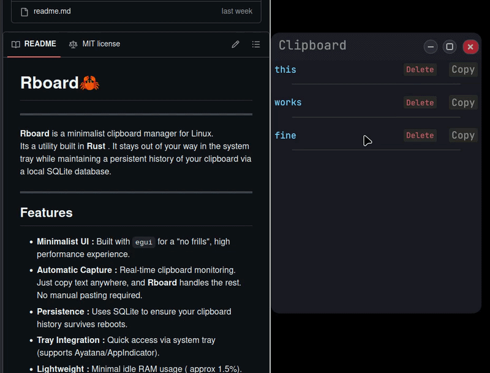
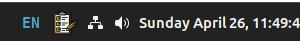

# Rboard🦀
---
**Rboard** is a minimalist clipboard manager for Linux.  
Its a utility built in **Rust** . It stays out of your way in the system tray while maintaining a persistent history of your clipboard via a local SQLite database.  

---
## Features  

*  **Minimalist UI :** Built with `egui` for a "no frills", high performance experience.    
*  **Persistence :** Uses SQLite to ensure your clipboard history survives reboots.  
* **Tray Integration :** Quick access via system tray (supports Ayatana/AppIndicator).  
* **Lightweight :** Minimal idle RAM usage ( approx 1.5%).  
* **Linux Native :** Specifically optimized for Linux Mint(XFCE) and Ubuntu(GNOME).  
---
### Live usage
---

---

**System tray integration**

~

--- 
---
##  Installation 

### Option 1(Recommended)   
---
**1. Download the latest `rboard-linux-x64.tar.gz` from the release page.**

**2. Run the following commands in order :**  
```
#Change to the directory you downloaded the .tar.gz to..

cd ~/Downloads

#Extract the zip into the current working directory.

tar -xf rboard*.tar.gz

#Change to the newly unarchived directoy.

cd ./rboard-*x64

#Make the install script executable.

chmod +x ./install.sh

#Run the install script.

./install.sh

#After it finishes open Rboard from your app menu or from the terminal like below

rboard
```

---

### Option 2: Build from source

- Since **Rboard** is built fully with rust you can build it your self( requires Rust/Cargo).

```
#Install dependencies 

sudo apt install libxdo-dev libayatana-appindicator3-dev libsqlite3-dev

# Clone and build

git clone https://github.com/Yonatan-Ethiopia/rboard.git

cd rboard

cargo build --release

```

---
## ⚠️ Known Issues (v0.1.0)

- **Wayland/GNOME Behavior :** On modern Ubuntu versions using Wayland, clicking the **X(Close)** button will only minimize the app to the taskbar/tray instead of hiding it completely. To fully close the app, use the **Tray Icon** menu. (The app needs to be running to capture copy actions).
- **Mesa/EGL Logs :** You may see "Failed to choose pdev" and related messages if you are running it from the terminal. These are non-critical driver fallback messages and do not affect the app's perfomance.

---
## Tech Stack 
-  **Language**: Rust🦀
-  **UI Framework:** `egui` / `eframe`
-  **Database**: SQLite
- **System Integration:** `libxdo` (global input), `libayatana-appindicator` (tray).
-  **Deployment/Built**: on **Docker** (Ubuntu 20.04 build enviroment for GLIBC compatibility). 

---
## 🤝 Contributing
  Feel free to open an issue or submit a pull request. I know **rboard** as alot of room for improvement. I welcome all feedback on system architecture and memory optimization!
